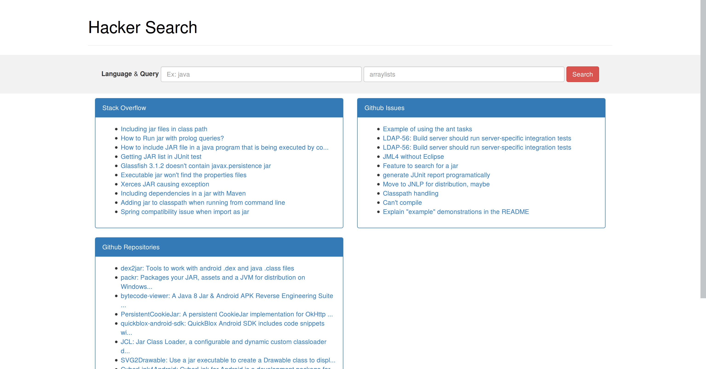

# Hacker Search
Hacker Search is a multi-site search engine for developers.



## Development
To run the website, run the following command in the terminal in the main directory of the project. Then go to `localhost:8008`.

```bash
make run
```
